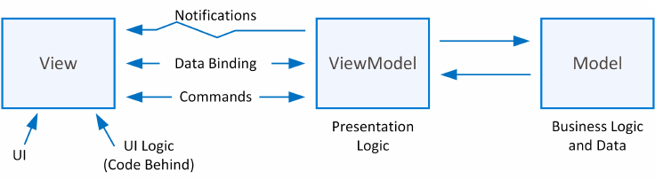
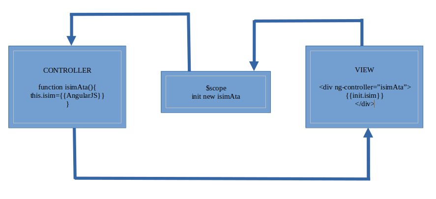

# Temel AngularJS Sayfa Yapısı
- **ng-app:** Direktif Angularjs in dahil edileceği bloktur. bu blokta yer alan bütün kodlar kapsama alanındadır.genelde ya body içerisine yadadirekt html içinde tanımlanır.
- **ng-model:** Direktif.değişken ismi tanımlamada kullanılır normal input elementlerinin name ve id gibi tanımlayıcı attribute özelliklerine benzetilebilir.
- **{{isim}}:** ifade ng-model ile tanımlanan değişkenlere erişmek için kullanılır

# AngularJs MVW (Model,View,Whatever,Work For You) Tasarım Mimarilerini Anlamak
Büyük çaplı projelerde karmaşıklığı önlemek için OOP kavramı gelişmişti.OOP artık profesyonel programlama dillerinden bir standart haline gelmiştir.İş geliştirme sürecinin daha da hızlanması daha kolay şekilde yapılması ve projelerin sürdürülebilir olmasını sağlamak amacıyla daha da farklı tasarım mimarileri geliştirilmiş ve geliştirilmeye devam edilmektedir.
## Tasarım mimarisi ihtiyacı
Tasarım mimarileri; Temel prensipte kullanıcı arayüzü ile arkaplan kodlarınını birbirinden ayırmak için ürtilmiştir. Yani daha ilkel bir tanım yapmak istersek bir projede bir kaç kişi kişi olsun bunlardan birisi arayüzü diğeri arka planı, ve diğeride veri tabanı mimarisini tasarlar işte bu üç kişiyi bir araya getirip projeyi oluşturmak için bir iş planı oluşturmak gerekir.Burada iş planı projenin hangi yaklaşım ile hazırlanacağıdır.

Tasarım mimarileri işte bu noktada yardıma koşar projenin ve ekibin durumuna göre en uygun iş modeli seçilir hatta bazen seçmeye bile gerek kalmaz.Mesela ufak bir projede eski usul metotlarla tüm projede bir sayfa kod yığınından ibaret olabilir proje çalışıyor olabilir ama geliştirilemez,ölçeklenemez ve sürdürülemez olacaktır.

**MVW** kavramı ile 3 farklı mimari anlaşılır Bunlar MVC, MVVM ve MVP dir.Angular bunlardan hangisini yapmak istiyorsanız bunu yapmanıza olarak sağlar

- **Model :** Uygulamaya ait iş mantığının olduğu;verilerin işlendiği ve doğrulandığı katmandır.Verilerin kaydedilmesi,güncellenmesi ve çekilmesi gibi işlemler bu katmanda yapılır.
- **View :** Adından da anlaşılacağı üzere kullanıcıların görmüş olduğu ve etkileşime gireceği nesnelerin bulunduğu katmandır.Model'den gelip ara katmanda işlenen veriler burada gösterilir.
- **Controller,Presenter,viewmodel :** model ve view arasında bir köprü görevindedir çift taraflı veri taşımacılığı yapar.



Şemayı incelediğimizde dikkat etmemiz gereken view ve model in birbirinden tamamen ayrık olduğudur.yani web sayfasının arayüzü ile sitenin verileri arasında bir bağ yoktur.Bağı controller,presenter veya viewmodel kurar.Pratikteki örneğinde ise web sayfanın ön yüzünü kodlayan kişinin sitenin veritabanı istemini kodlayan kişi ile ortak bir iş yapmasına gerek yoktur. yani bugün yayında olan bir web sayfası mvc mantığı ile programlanmışsa sitenin veritanında herhangi bir değişiklik yapmadan arayüzü değiştirebilirsiniz.

MVVM' de şu temel kuralları bilelim... VIEW,VIEWMODEL'daki elementlere erişebilir fakat MODELVIEW kesinlikle VIEW'e erişemez.Aynı şekilde VIEWMODEL de MODEL'in içinde ne olduğunu bilir yani sorgular veritanı yapısı vs.MODEL'de ise VIEWMODEL'deki hiçbir fonksiyon bilinmez ve erişilemez.

Yukarıdaki şemada VIEW ile VIEWMODEL arasında **Data Binding**,**Commands** ve **Notifications**'lar görülmektedir.
Data Binding: Veri bağlama VIEW üzerinde yer alan inputlardan alınan verilerle **MODELVIEW** de yer alan **fonksiyonlara(kontrollere)** çift taraflı olarak verilerin bağlanmasıdır.
**Commands(komutlar)**'da **VIEW** ve **VIEWMODEL** içerisindeki fonksiyonların tetiklenmesi içindir.

## AngularJS'in Yapıtaşları ve Kullanımı
5 temel kavram vardır bunlar;
- Direktifler,
- İfadeler,
- Kontroller,
- Modüller,
- Scope,
olmak üzere AngularJS'in Temel yapı taşlarıdır.

### İfadeler (Expression ng-model ve {{ }} )
İfadeler değişken değerlerini veya AngularJS metotlarına göre işlem yapmayı tanımlar.Direktiflerin( {{ **ifade** }} ) arasında yazılır.Direktifler arasında yazılan kodlar AngularJS tarafından işlenir

### Direktifler ( {{ }} )
Direktif içerisinde metin yazdırmak için " " kullanılabilir ve metinler birleştirilmek için + operatoru kullanılabilir ancak direktif içerisinde html etiketleri yazdırılamaz.

- ng-init: içerisinde değişkenler tanımlanabilir.
- data-ng-repeat: foreach veya "for i in dizi" benzeri bir yapı

## Şablon (Template),Modüller (Module), Kontroller (Controller)
MVW modeline göre Controller yani VIEWMODEL ayrı tutulmalıdır.Bu nedenle AngularJS komutlarımız harici kaynaktan HTML5 sayfası içine çekilerek (yine js dosyası) kullanılmalıdır.

### Template
Bir web projesi oluştururken birçok html yada php vs. sayfadan oluşabilir.html etiketlerinin arasında ng-app tanımlamaları birer template oluşturmaktadır.Tek bir template kullanılacabileceği gibi birden fazla template de kullanılabilir.<br>
```
<html ng-app="ansayfa">
```
gibi bir tanımlama ile artık "anasayfa" adında bir template olmuş olur.<br>
veya <br>
```
<div ng-app="uyegiris"></div>
<div ng-app="uyekayit"></div>
```
şeklinde tanımlanabilir.

### Module
Tanımlanan her bir template için bir modül tanılanmalıdır.Modül ile template birbiri ile ilişkilendirilmelidir.Template işin VIEW kısmını,Modul ise VIEWMODEL kısmını oluşturur.
```
var modulismi=angular.module("templateIsmi",[])
```
bu yapı ile modül tanımlanan template e bağlanmış olur.
```
angular.module("kombineModul",["modul1","modul2"]);
```
Bu şekilde modul1 ve modul2 birbiri ile kombine olmuş ve tek bir çatıda kombineModul ismi ile birleşmiş

## Controller ve $scope
Controller bildiğimiz fonksiyon yapıları bir diğer bakış açısıyla modul içindeki metotlardır.Modul içinde Controller tanımlanır ve herhangi bir DOM elementinin ng-controller direktifi ile ilgili Controller'a doğrudan çift taraflı olarak (data binding) bağlanılır.
```
<div ng-cotroller="kontrolIsmi"></div>
```
Bir controller'a balanınca da o Control içinde yapılan işlemlerin sonuçları $scope sayesinde iletilir.Controller'dan üretilen değerler yine $scope sayesinde DOM'a aktarılır.Controller içinde bir değer ataması yaparken (ng-model ile tanımlanmış değişkenler) mutlaka başlarına $scope referansı eklenmiştir.

$scope; VIEW ile VIEWMODEL arasındaki köprüyü kurar.VIEW'den alınan değer önce $scope'a $scope'tan da VIEWMODEL'e aktarılır.Ancak VIEWMODEL'de üretilen değer doğrudan VIEW'a aktarılır.



## Direktifler
Direktifler, AngularJs'in temel bağlantı elemanlarından biridir.HTML5 sayfa yapısında yer alan elementleredirektifler ile erişilir ve yönetilir.Direktifler birer attribute olarak tanımlanır bazıları değer alabilirken bazıları sadece anahtar kelime olarak bile tanımlama yapmak için yeterlidir.Direktifler ng-ön eki ile başlar ve diğer isimlerle direktifler türetilir.Temel olarak AngularJS'deki direktifler aşağıdaki verilmiştir.

### ng-app
html ve body etiketleri arasında kullanılır ancak başka etiketlerin içerisinde de kullanmak mümkündür.
```html
<html ng-app>
```
veya
 ```html
 <body ng-app>
 ```
### ng-init
AngularJs kapsama alanı tanımlandığında değişkenleri (sayı,metin,obje ve dizi) tanımlamak için kullanılır.ng-app ile birlikte eş zamanlı kullanılır.
```html
<div ng-app
ng-init="sayilar=[sayi=3,sayi=5]; metinler={isim:'deniz',soyisim='ufuk'}"></div>
```
### ng-model
Bir değeri alıp DOM içinde {{ }} ifadesi içinde kullanmamızı sağlar.Değeri alabilmek için de DOM elementini bir model olarak tanımlayıp model ismi belirmemiz gerekir. Model ismi " " çift tırnak ile belirtilir, değişken tanımlama kurallarına uyulur.
```html
<body ng-app>
    <input type="text" ng-model="isim"/>
    <div>
        Merhaba {{isim}}
    </div>
</body>
```
burada oluşturduğumuz her bir model,AngularJS'de scope olarak tanımladığımız değişken kapsama alanı altında tutulacaktır.Yani scope ile Controller içinden bu değerlere ulaşabiliriz.
### ng-bind
scope veya ng-model ile bir veriyi alıp DOM elemanına bağlamada kullanılır.
```html
<body ng-app="">
<div>
    <div>İsminiz: <input type="text" ng-model="isim"></div>
    <div>Merhaba <span ng-bind="isim"></span></div>
</div>    
</body>
```
### ng-repeat
bir işlemi tekrarlamada kullanılır.<br>
**tablo çizdirme örneği**
```html
<body ng-app ng-init="hayvanlar=['kedi','kopek','fare']">
    <div ng-repeat="hayvan in hayvanlar" style="border:1px solid black;padding:5px">
    {{hayvan}}</div>
</body>
```
### ng-readonly
DOM elementinin (veri girişi ile ilgili olanlar) içeriğinin sadece okunabilir veya yeniden düzenlenebilir olmasını sağlar.True değeri alınırsa sadece okunur olur.
```html
<div>
    <input ng-readonly="false" type="number" placeholder="10">
    <input ng-readonly="true" type="text" placeholder="AngularJs">
</div>
```
### ng-disable
True veya false değeri alarak DOM elemanının aktif veya pasif olmasını sağlar.<br>
checkbox ın tıklanma durumuna göre bir metin kutusunu aktif veya pasif yapmak
```html
<body ng-app ng-init="secildimi=true">
    <div>
        <input type="checkbox" ng-model="secildimi"> 
        <input type="text" ng-disabled="secildimi" value="...">
    </div>
</body>
```
### ng-click
Bir DOM elementinin tıklanması olayı ile tetiklenecek olan Controller fonksiyonu tanımlanır.

### ng-show
Bir DOM elementini gizleyip tekrar gösterebiliriz.<br>
ornek olarak bir resim gizleme uygulaması
```html
<!DOCTYPE html>
<!-- template tanımı-->
<html ng-app="hayvanlarAlemi">
<head>
  <meta charset="UTF-8">
  <meta http-equiv="X-UA-Compatible" content="IE=edge">
  <meta name="viewport" content="width=device-width, initial-scale=1.0">
  <script src="./lib/angular-1.8.2/angular.min.js"></script>
  <title>ng-click</title>
<script>
    // modül oluşturulması
  var uygulama = angular.module('hayvanlarAlemi', []);
  // oluşturulan modülün template nin içerisindeki controller a ulaşmak
  uygulama.controller("gosterKontrol", function($scope) {
    // cotroller üzerinden artık işlemlerin uygulanması
        $scope.kontrolEt = function() {
          if ($scope.hayvanlar_liste == "kedi") {
            $scope.kediGoster = true;
            $scope.kopekGoster = false;
          } else {
            $scope.kediGoster = false;
            $scope.kopekGoster = true;
          }
        }
    });
</script>
<body>
    <!--controller tanımlası-->
<div ng-controller="gosterKontrol">
    <!--model tanımı ve fonksiyonun atanması-->
    <select ng-model="hayvanlar_liste" ng-change="kontrolEt()">    
	    <option value="kopek" selected >Köpek</option>
	    <option value="kedi" >Kedi</option>
	</select>
    <div ng-show="kediGoster">
		
    </div>
    <div ng-show="kopekGoster">
		
    </div>
</div>
</body>
</html>
```
### ng-if
Bu ifade koşul sağlanması durumunu kontrol etmek için kullanılır.yine bir modül içerisinde yer alan controller içindeki metot çağrılır ve bu metot ile true veya false değerleri elde edilir.Böylece işlemler yapılır.ng-if içerisinde mantıksal operatorler ve işlemler tanımlanabilir.
```html
<body ng-app>
    <input type="text" ng-model="isim">
    <div ng-if="isim=='gizli_kelime'">GİZLİ KELİMEYİ BULDUNUZ</div>
</body>
```
### ng-class
Bir DOM elementinn class değerini okumaya veya değiştirmeye yarar yani bir css stilini bir elemente aktarabilmemiz daha kolay olur.
```html
<body ng-app>
    <input type="button" value="stil 1" ng-click="yeniclass='class1'">
    <input type="button" value="stil 2" ng-click="yeniclass='class2'">
<div>
    <p ng-class="yeniclass">AngularJS</p>
</div>
</body>
```
```css
.class1{
    border:4px solid blue;
    color:red;
    padding:10px;
    background-color:yellow;
}
.class2{
    border:blue;
    padding:4px;
    background-color:pink;
}
```
### ng-style
ng-class gibi stil ataması yapmak için kullanılır.Bu sefer css dosyası kullanmadan doğrudan object nesnesi ile stilleri atayalım.
```html
<body ng-app>
<input type="button" value="stil 1" ng-click="stil={'background-color':'red','color':'white'}">
<input type="button" value="stil 2" ng-click="stil={'background-color':'white','color':'red'}">
<div>
    <p ng-style="stil">AngularJS</p>
</div>
</body>
```
## Özelleştirilmiş Direktifler Oluşturmak, Etki Türleri/Rollerini Belirlemek,Direktif ve Controller Arası Veri Değişimi
Kendi direktiflerimizi oluşturmamız için module kullanmamız gerekir.XML'de olduğu gibi kendi tanımlayacağımız bir element için direktif oluşturabiliriz.Direktif olarak tanımlayacağımız elementin geçtiği yerde de otomatik olarak direktif çalışacaktır.
```html
<!DOCTYPE html>
<!--ng-app ile anasayfa adında bir uygulama tanımlandı-->
<html lang="en" ng-app="anasayfa">
<head>
    <meta charset="UTF-8">
    <meta http-equiv="X-UA-Compatible" content="IE=edge">
    <meta name="viewport" content="width=device-width, initial-scale=1.0">
    <script src="./lib/angular-1.8.2/angular.min.js"></script>
    <title>Özelleştirilmiş direktifler</title>
    <script>
        // anasayfa adında bir modul tanımlandı
        var anasayfa = angular.module('anasayfa',[]);
        // directif tanımlaması yapıldı
        anasayfa.directive('etiket',function(){
            //
            var directive={};
            /* üç farklı şekilde direktif tanımlanabilir 
            E : element <test></test>
            A : Attribute <div test></div>
            C : Class <div class="test"></div>
            Bu tanımlar AE veya AEC şeklinde de kullanılabilir ve ek olarak birde M vardır 
            M : comment
            yani açıklama satırı olarak verilmiş kodlarda çalışır böylece test tabanlı programlama yapma şansımız olur. 
            */
            // E değeri DOM elementi olduğu anlamına geliyor.
            directive.restrict='E';//element
            // template ile bu direktifin kullanıldığı yerde yazdırılacak olan metin tanımlandı
            directive.template="Merhaba etiket";
            return directive;
        });
    </script>
</head>
<body>
<etiket></etiket>
</body>
</html>
```

üç farklı şekilde direktif tanımlanabilir<br>

    E : element <test></test>
    A : Attribute <div test></div>
    C : Class <div class="test"></div>
    
Bu tanımlar AE veya AEC şeklinde de kullanılabilir ve ek olarak birde M vardır 

    M : comment

yani açıklama satırı olarak verilmiş kodlarda çalışır böylece test tabanlı programlama yapma şansımız olur. 

**restrict :** E, A, C, M veya bunların türevlerini parametre olarak alır.Böylece elemente mi attribute'e mi class'a mı yoksa açıklama satırına mı veya bunlardan birkaçına mı etki edeceği filtrelenir.

**return :** Direktifin çalışması sonucunda döndürülecek olan işlemleri belirtir.

**scope :** Direktifin kapsama alanını belirler eğer kendi faaliyet alanı kullanılacaksa link fonksiyonu içindeki scope'tan alır.Fakat başka kapsama alanları da tanımlanabilir.

**link :** Direktifin aktif olması ile birlikte çalışacak olan fonksiyonu tanımlar.Fonksiyon bir takım parametreleri sırasıyla (yani doğru bir sırada yazılmalı)alır.Böylelikle erişimler sağlanır.Alacağı parametreler scope,attribute,element ve controller'dir.Aslında bu isimlerle de vermemiz gerekmez, Kısaltılmış da verebiliriz.önemli olan sıralarıdır.

**template :** bir html içerik üretmemizi sağlar.

**controller :** Bir direktif içinde veri alışverisi ve işlem yapılacaksa Controller oluşturmak için kullanılır.Böylece bu tür direktifler ana Controller'dan veya Module'den bağımsız olabilir.

**Devamını oku uygulaması**<br>
```html
<!DOCTYPE html>
<html lang="en">
<head>
    <meta charset="UTF-8">
    <meta http-equiv="X-UA-Compatible" content="IE=edge">
    <meta name="viewport" content="width=device-width, initial-scale=1.0">
    <script src="./lib/angular-1.8.2/angular.min.js"></script>
    <title>Devamını Oku Uygulaması</title>
    <script>
        var uygulama=angular.module('uygulama',[])
        uygulama.controller("MetniAc",function($scope){
            $scope.HepsiniGoster=function(){
                document.getElementById('1').innerHTML=TamMetin;
            }
        });
        uygulama.directive("soz",function(){
            return{
                restrict:"E",
                link:function($scope,element){
                    TamMetin=element.html();
                }
            }
        });
        uygulama.directive("ozlusoz",function(){
            return{
                restrict:"A",
                link:function($scope,element){
                    element.html(element.html().substring(0,25).concat("..."));
                }
            }
        });
    </script>
</head>
<body ng-app="uygulama">
    <div id="1" ng-controller="MetniAc">
        <soz ozlusoz >Lorem, ipsum dolor sit amet consectetur adipisicing elit. Consectetur minima nihil a? Voluptatem voluptatum culpa ducimus, libero officiis necessitatibus a itaque repellat sequi eligendi temporibus. Assumenda quis voluptas facere nesciunt!
        Sint culpa ipsa aliquam, magnam, delectus reprehenderit deleniti nam perspiciatis nisi vitae eos qui debitis excepturi voluptatem ea! Quam eos quaerat rem pariatur saepe at est. Autem hic officia explicabo.
        Iure omnis architecto qui sapiente eligendi inventore numquam cum explicabo, aliquam, voluptate deserunt vel officia necessitatibus quaerat ullam quam, veritatis dolorum delectus iste maxime amet incidunt illo illum! Sed, repellat.
        Placeat eos magni consequatur vero minima cum, repellat rem quisquam repellendus blanditiis? Repellat sunt autem est ad deleniti doloribus unde obcaecati aliquam quod distinctio eius, facere, nisi nostrum nesciunt soluta?
        Dicta sed hic rerum quaerat quasi qui consequuntur expedita harum voluptas distinctio quos natus obcaecati suscipit iste, exercitationem, reprehenderit autem sapiente architecto, nihil ducimus. Modi deserunt mollitia laboriosam debitis pariatur.</soz>
        <button ng-click="HepsiniGoster()" style="border-radius:28px;border:none;padding:5px;background-color: #00BFFA;">devamını oku</button>
    </div>
</body>
</html>
```
### $compile Derleme Sevisi ile Türetilen Elementlerle Çalışmak
$compile servisi,Directive veya Controller içindeki bir html içeriğini derlememizi sağlar Daha somut ifade etmek gerekirse html5 sayfası yüklendiğinde AngularJS kodlarının olduğu JS dosyası veya html5 içinde script içine gömülüyse çalıştırılır ve derlenir.Fakat bu mantıkla bakıldığında ilk olarak html5 sayfsı baştan aşağı okunur,sonra AngularJS çalıştırılır.Yani AngularJS çalıştığında HTML5 sayfası üzerinde bir değişiklik yapılmaışsa artık o değişiklik yapılan kısım görmezden gelinir.Bu gibi durumlarda $compile servisi kullanılarak bazı alanlar tekrar derlemeye alınır.

Yapacağımız örneğimizde şöyle bir sorunumuz olacak.Yine bir önceki örneğimizde olduğu gibi bir metin kısaltması yapacağız ve butona tıklandığında tamamını göstereceğiz ancak burada farklı olarak butonu doğrudan html5  sayfasına yazmakta ziyade butonu directive içinde String olarak tanımlayıp,sözün arkasına ekleyeceğizButona tıklandığında dediğimiz derleme sıkıntısı burada yaşanıyor butonu sonradan ekleyeceğimiz için AngularJs bunu görmeyecektir.Bunedenle $compile servisi kullanıp eklediğimiz butonu da tekrar AngularJS kapsama alanına çekeceğiz.

örnekte metni kırpma işlemini farklı bir mantıkla yapacağız metni iki farklı etikete yayacağız özlü sözü soz etiketleri içinde etiket açıp sözün kime ait olduğunu yazacağız bu etiket daha önce gördüpümüz ng-if direktifi ile kontrol edilecek Kontrol değişkenin true/false değerlerine göre bu etiketin içeriği görünür olacak veya görünmeyecek, görünürlüğündeğişken parametresini değiştirebilmek için de directive içinde tanımlayacağımız span etiketleri ile devamını oku şeklinde bir metin oluşturup bu etikete ng-click direktifi ekleyerek bir controller tetikleyeceğiz controller içinde de true/false değerlerini her tıklamada sürekli tersi durumu hale getiren basit bir atama işlemi yapacağız.


**Devamını oku uygulaması-2**<br>
```html
<!DOCTYPE html>
<html lang="en">
<head>
    <meta charset="UTF-8">
    <meta http-equiv="X-UA-Compatible" content="IE=edge">
    <meta name="viewport" content="width=device-width, initial-scale=1.0">
    <script src="./lib/angular-1.8.2/angular.min.js"></script>
    <title>Devamını Oku Uygulaması</title>
    <script>
        var uygulama=angular.module('uygulama',[])
        uygulama.controller("DevaminiOku",function($scope){
            $scope.oku=function(){
                $scope.goster=!$scope.goster;
            }
        });
        uygulama.directive("ozlusoz",function($compile){
            var DevaminiOkuButonu="<span ng-click='oku()'>+</span>";
            return{
                restrict:"A",
                link:function(scope,element){
                    var eklenecekIcerik=$compile(DevaminiOkuButonu)(scope);
                    element.append(eklenecekIcerik);
                }
            }
        });
    </script>
</head>
<body ng-app="uygulama" ng-init="goster=false">
    <div ng-controller="DevaminiOku">
        <soz ozlusoz >Lorem, ipsum dolor sit amet consectetur adipisicing elit. Consectetur minima nihil a? Voluptatem voluptatum culpa ducimus, libero officiis necessitatibus a itaque repellat sequi eligendi temporibus. Assumenda quis voluptas facere nesciunt!
        Sint culpa ipsa aliquam, magnam, delectus reprehenderit deleniti nam perspiciatis nisi vitae eos qui debitis excepturi voluptatem ea! Quam eos quaerat rem pariatur saepe at est. Autem hic officia explicabo.
        Iure omnis architecto qui sapiente eligendi inventore numquam cum explicabo, aliquam, voluptate deserunt vel officia necessitatibus quaerat ullam quam, veritatis dolorum delectus iste maxime amet incidunt illo illum! Sed, repellat.
        Placeat eos magni consequatur vero minima cum, repellat rem quisquam repellendus blanditiis? Repellat sunt autem est ad deleniti doloribus unde obcaecati aliquam quod distinctio eius, facere, nisi nostrum nesciunt soluta?
        Dicta sed hic rerum quaerat quasi qui consequuntur expedita harum voluptas distinctio quos natus obcaecati suscipit iste, exercitationem, reprehenderit autem sapiente architecto, nihil ducimus. Modi deserunt mollitia laboriosam debitis pariatur.
            <yazar ng-if="goster" style="margin-left:10px">lorem ipsum</yazar>
    </soz>
    </div>
</body>
</html>
```
### Filters (Filtre)
Filtreler,AngularJS'de verileri formatlamaya, dönüştürmeye sıralamaya ve bunun gibi bir takım işleri yapmaya yarayan hazır metotlardır.

```html
<script>
    angular.module("filtreler",[]).controller('ctrl',function($scope){
        //$scope değişkenleri burada...
    });
</script>
<div ng-app="filtreler" ng-controller="ctrl">
    <h1></h1>
</div>
```
Burada AngularJs projeye dahil ediliyor ve basit bir module oluşturup direkt controller tanımladık div içerisinde de h1 tag i var bunun içerisindede filtreler test edilecek.<br>

**örnek currency**<br>
<code>$scope.bakiye=19000;</code><br>
**filtrelenmesi**<br>
<code>&lt;h1&gt;{{bakiye|currency}}&lt;/h1&gt;</code><br>
**çıktı :**<br>
<code>$19,000.00</code> 

**örnek date**<br>
tarih değerinin js ile alınması<br>
<code>new Date().getTime();</code>
```html
<h1>{{tarih |date :'short'}}</h1>
<h1>{{tarih |date :'medium'}}</h1>
<h1>{{tarih |date :'shortDate'}}</h1>
<h1>{{tarih |date :'mediumDate'}}</h1>
<h1>{{tarih |date :'longDate'}}</h1>
<h1>{{tarih |date :'fullDate'}}</h1>
<h1>{{tarih |date :'shortTime'}}</h1>
<h1>{{tarih |date :'mediumTime'}}</h1>
```

**örnek upper-lower-case** 
```html
<h1>{{metin | lowercase}}</h1>
<h1>{{metin | uppercase}}</h1>
```
**filter**<br>
array veya object verierinde uygulanır.filtre olarak vermiş olduğunuz paramtre değerini dizi değerleri içerisinde tek tek arar ve bu parametre değerini hangi elemanda bulduysa o elemanı verir.Yani o veri nesnesi içinde sadece filtre olarak vermiş olduğunuz değerler varmış gibi davranış gösterir.genellikle ng-repeat ile kullanılır.filter a verilen değeri içinde barındırılan tüm elemanlar meyve içerisinde döndürülür
<code>$scope.meyveler = ['elma','üzüm','karpuz','armut','karpuz']</code>
```html
<h1 ng-repeat="meyve in meyveler | filter: 'armut'"> </h1>
```

**orderBy**<br>
Bir JSON verisinde bir key'e göre sıralama yapmamızı sağlar bura sıralama ASC veya DESC metoduyla yapılabilir.Yani artan veya azalan şeklinde bir sıralama yapılabilmektedir.